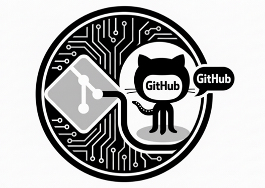

# Projecte intermodular: El meu perfil professional amb Git i GitHub

  

## Comentaris reunió

- Projecte totalment individual, no hi ha grups.
- Durada 10 hores perquè el 9 d'octubre hi ha la sortida.
- Tasques a realitzar:

  - Creació del compte de GitHub i primer repositori (2 hores)
  - Un primer repositori de prova amb un `README.md` senzill (4 hores)
  - Repositori de perfil amb un `README.md` amb la presentació de l'alumne (4 hores).

## Presentació

En el món dels sistemes microinformàtics i les xarxes, els tècnics treballen sovint amb fitxers de configuració, scripts, documentació i projectes que evolucionen amb el temps. Git permet registrar aquests canvis, recuperar versions anteriors i treballar amb més seguretat. GitHub afegeix un espai remot per compartir codi i documentació, col·laborar amb altres persones i construir una mostra pública del propi treball.

Ara farem una primera aproximació pràctica a Git, GitHub, Visual Studio Code i Markdown. Al llarg del curs, treballarem habitualment amb aquestes eines, i aquest segon projecte serveix per introduir-vos a aquestes tecnologies i a la metodologia de treball que utilitzarem.

## Repte

Crear i publicar un repositori de perfil a GitHub, editat amb Visual Studio Code, que presenti l'alumne com a futur tècnic o tècnica de sistemes microinformàtics i xarxes.

El repositori final ha d'incloure:

- Un `README.md` de perfil ben estructurat.
- Una presentació breu i professional.
- Les competències i tecnologies que es volen aprendre.
- Un apartat de projectes o pràctiques, encara que siguin propostes inicials.
- Un registre de canvis fet amb commits clars.
- Com a mínim un canvi editat en local amb Visual Studio Code i sincronitzat amb GitHub.

## Objectius d'aprenentatge

En acabar el projecte, l'alumne ha de poder:

1. Crear i configurar un compte de GitHub amb criteris de seguretat.
2. Instal·lar i configurar Git i Visual Studio Code.
3. Crear, clonar i obrir un repositori amb Visual Studio Code.
4. Escriure documentació bàsica amb Markdown.
5. Entendre la diferència entre còpia de treball, repositori local i repositori remot.
6. Fer les operacions bàsiques de Git: `status`, `add`, `commit`, `pull` i `push`.
7. Consultar l'historial de canvis i corregir errors senzills.
8. Publicar una presentació professional en un repositori de GitHub.

## Resultats d'aprenentatge i criteris d'avaluació

RA5. Transmet informació amb claredat, de manera ordenada i estructurada.

5.1 Manté una actitud ordenada i metòdica en la transmissió de la informació.
5.3 Transmet informació entre els membres del grup utilitzant mitjans informàtics.

## Organització i durada

La durada total és de **10 hores**, distribuïdes en **dues setmanes**:

| Setmana | Sessió | Activitat   | Continguts                           | Producte                           |
|---      |---:    |---          |---                                   |---                                 |
| 1       | 1      | Activitat 1 | Compte, seguretat i instal·lació     | Compte creat i eines preparades    |
| 1       | 2      | Activitat 1 | Repositori, clonació i primer `push` | Primer repositori sincronitzat     |
| 1       | 3      | Activitat 2 | Sintaxi Markdown amb VS Code         | Document Markdown complet          |
| 2       | 4      | Activitat 2 | Git local i historial                | Historial de commits coherent      |
| 2       | 5      | Activitat 3 | Disseny del perfil i edició local    | Perfil professional en construcció |
| 2       | 6      | Activitat 3 | Publicació, revisió i presentació    | Repositori de perfil acabat        |

Equip de treball: grups de 2 o 3 alumnes. Cada grup ha de crear un Kanban per a organitzar les tasques i fer un seguiment del projecte.

## Evidències que cal lliurar

- Enllaç al vostre compte de GitHub.
- Repositori corresponent a l'activitat 2, que tingui els següents requisits:
  - Historial amb, com a mínim, 4 commits descriptius.
  - Document en format Markdown, correctament estructurat i amb contingut rellevant.

## Avaluació

| Criteri                                              | Pes |
|---                                                   |---: |
| Compte i configuracióde GitHub                       | 15% |
| Ús correcte de Git local i sincronització amb GitHub | 30% |
| Estructura i sintaxi Markdown                        | 20% |
| Qualitat i professionalitat del repositori de perfil | 25% |
| Historial de commits, autonomia i autoavaluació      | 10% |

Per superar el projecte, cal publicar el repositori i poder explicar el recorregut d'un canvi: edició, estat, preparació, commit i sincronització.

## Normes de seguretat i convivència digital

- Crear un un compte de GitHub amb un nom d'usuari adient i descriptiu.
- Fer servir una adreça de correu adequada per a l'activitat acadèmica.
- Revisar la visibilitat dels repositoris.
- Utilitzar noms de fitxer i missatges de commit clars i respectuosos.
- No copiar un perfil sencer d'una altra persona: es poden consultar exemples, però el contingut ha de ser propi.

## Materials

- Ordinador amb connexió a Internet.
- Compte de GitHub.
- Git instal·lat.
- Visual Studio Code instal·lat.
- Les guies de la carpeta `guies/`.

## Resultat final esperat

Un tercer que visiti el repositori ha de poder entendre en menys d'un minut qui és l'alumne, què està aprenent i quines pràctiques o projectes vol mostrar. El repositori no ha de ser perfecte: ha de ser clar, segur, coherent i susceptible de millora.
