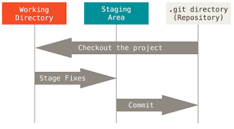
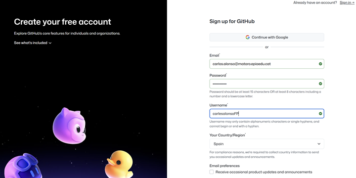
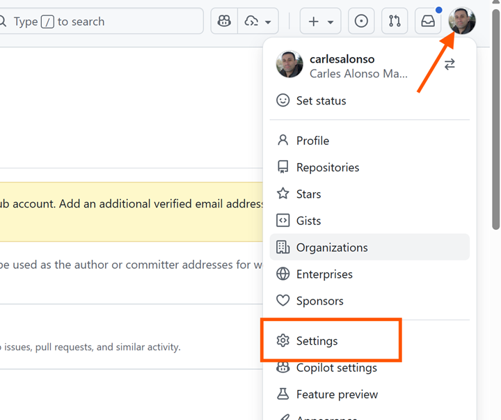
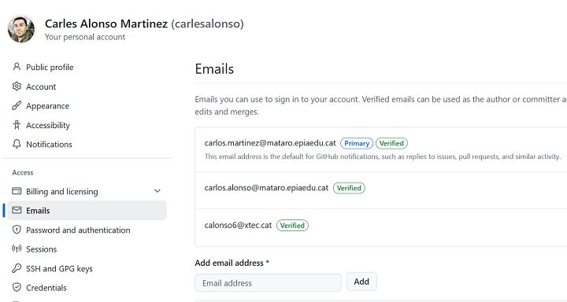
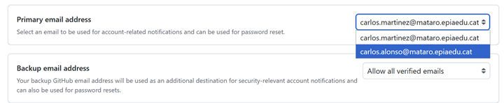
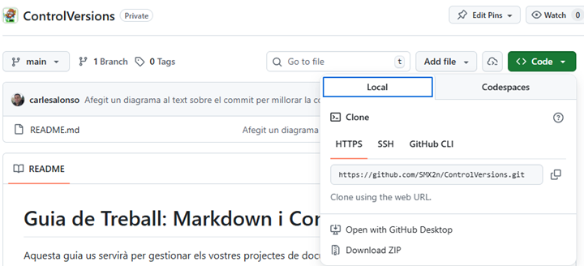
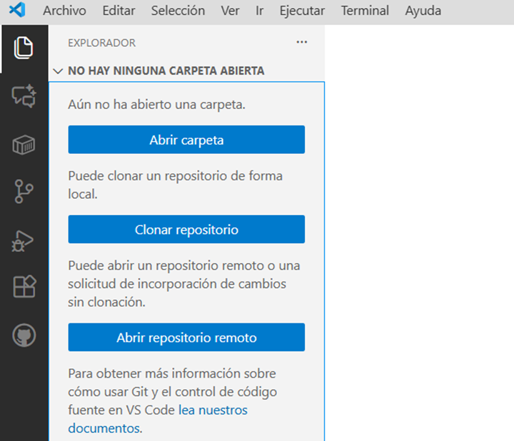
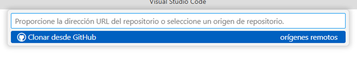

# Guia 1. Iniciació a Git, GitHub i Visual Studio Code

## Introducció control de versions

El control de versions és un sistema que registra els canvis realitzats en un conjunt de fitxers al llarg del temps. Permet als desenvolupadors col·laborar en projectes, fer seguiment dels canvis i revertir a versions anteriors si és necessari. Git és un dels sistemes de control de versions més populars i utilitzats actualment.

I per què en cal un control de versions? Doncs per diversos motius:

- **Col·laboració**: Permet a diversos desenvolupadors treballar en el mateix projecte sense conflictes
- **Historial**: Permet veure l'historial de canvis realitzats en el projecte, així com qui ha realitzat cada canvi.
- **Reversió**: Permet revertir a versions anteriors del projecte si és necessari
- **Còpia de seguretat**: Permet tenir una còpia de seguretat del projecte en cas de pèrdua de dades.

No usar control de versions, provoca que per evitar problemes a l'hora de modificar arxius i no voler perdre l'estat actual, ens porta a solucions com per exemple crear carpetes per cada estat del projecte o anar reanomenant els fitxers amb dates i hores, que són poc pràctiques i poden portar a errors i confusions.

## Git

Tot i que Git no va ser el primer sistema de control de versions, sí que va ser el primer que va permetre treballar de manera distribuïda, és a dir, cada desenvolupador té una còpia completa del projecte i de l'historial de canvis al seu ordinador. De fet, el seu creador va ser Linus Torvalds, el creador del nucli Linux, que necessitava un sistema de control de versions per al desenvolupament del nucli.

El protocol git està disponible en molts sistemes operatius, com ara Linux, macOS i Windows. A més, hi ha moltes interfícies gràfiques i eines que faciliten l'ús de Git, com ara GitKraken, Sourcetree, etc. si no voleu utilitzar la línia de comandes. La major part d'editor de codi, com ara Visual Studio Code, tenen integració amb Git, de manera que tampoc cal instal·lar eines addicionals.

### Tinc git al meu ordinador?

En equips amb Linux o macOS, és probable que ja tingueu Git instal·lat. Podeu comprovar-ho obrint una terminal i escrivint la comanda següent:

```bash
git --version
```

Si Git està instal·lat, veureu la versió de Git que teniu instal·lada. Si no està instal·lat, veureu un missatge d'error indicant que la comanda no es troba.

En equips amb Windows, és probable que no tingueu Git instal·lat. Podeu descarregar-lo des de la pàgina oficial de [Git](https://git-scm.com/download/win). Un cop descarregat, executeu l'instal·lador i seguiu les instruccions per a instal·lar Git al vostre ordinador. També el podeu instal·lar mitjançant el gestor de paquets `Winget` amb la comanda següent:

```Powershell
winget install Git
```

### Conceptes bàsics de Git

Tot i que de moment només farem servir Git a través de la interfície web de GitHub, és interessant conèixer alguns conceptes bàsics de Git.

- **Repositori**: És el lloc on es guarda el projecte i l'historial de canvis. Pot ser local (al vostre ordinador) o remot (a un servidor com GitHub).
- **Commit**: És una instantània del projecte en un moment concret. Cada commit té un identificador únic i un missatge descriptiu dels canvis realitzats.

A l'hora de treballar amb Git, hi ha tres estats principals:

- **Directori de treball (Working Directory)**: És on es troben els fitxers del projecte al vostre ordinador. Podeu modificar els fitxers en aquest estat.
- **Àrea d'escenari (Staging Area)**: És on es preparen els fitxers per a ser inclosos en el proper commit.
- **Repositori (Repository)**: És on es guarden els commits. Un cop un fitxer està en el repositori, forma part de l'historial de canvis.



Això vol dir que quan modifiqueu un fitxer al directori de treball, primer heu de preparar-lo per a ser inclòs en el proper commit (afegir-lo a l'àrea d'escenari) i després fer el commit per a guardar els canvis al repositori. Per tant, en un moment donat, un fitxer pot tenir diferents versions en els diferents estats.

### Configuracions inicials de Git

Git necessita saber qui sou per a poder registrar els vostres commits. Per a això, cal configurar el vostre nom i correu electrònic amb les comandes següents:

```bash
git config --global user.name "El vostre nom"
git config --global user.email "el_vostre_correu_electrònic"
```

Això, aquest nom i correu electrònic s'utilitzaran per a identificar els vostres commits. Si voleu canviar aquesta informació més endavant, podeu fer-ho amb les mateixes comandes. No té perquè coincidir amb el nom i correu electrònic del vostre compte de GitHub, però és recomanable que ho faci per a que els vostres commits estiguin associats al vostre compte de GitHub.

Aquesta configuració global s'aplica a tots els repositoris del vostre ordinador, però requereix permisos d'administrador. Si no els teniu, o bé, si en un repositori voleu utilitzar un nom i correu electrònic diferents, podeu configurar-los només per a aquest repositori amb les comandes següents que podeu executar obrint un terminal dins de l'editor, un cop heu obert el projecte amb Visual Studio Code:

```bash
git config user.name "El vostre nom"
git config user.email "el_vostre_correu_electrònic"
```

>⚠️ Quan hi treballem sense definir configuracions globals, és molt important realitzar el pas anterior abans de fer el primer commit, ja que si no, Git no podrà identificar-vos i us donarà un missatge d'error.

## GitHub

GitHub és una plataforma de desenvolupament col·laboratiu de programari que utilitza el sistema de control de versions Git. A més de les funcionalitats de Git, GitHub afegeix les seves pròpies funcionalitats, com ara la interfície gràfica web, l'eines de gestió de tasques, etc.

Existeixen alternatives com GitLab o Bitbucket, però GitHub és la més popular. GitHub permet allotjar projectes de codi obert i privats, així com oferir funcionalitats com a fork, pull request, wiki i gestió de tasques.

### Crear un compte a GitHub

Per a crear un compte a GitHub, cal anar a la pàgina principal de [GitHub](https://github.com) i clicar a [Sign up](https://github.com/signup).

Cal omplir les dades, on primer de tot, cal indicar un correu electrònic, com dona problemes si seleccioneu el correu d'escola, useu un correu personal, un cop creat el compte, ja el canviarem. A continuació, cal indicar una contrasenya segura, **apunteu-la en un lloc segur o useu un gestor de contrasenyes**. Després, cal indicar un nom d'usuari,useu sempre noms identificatius i eviteu noms suposadament graciosos o de mal gust. Finalment, cal indicar si voleu rebre informació de GitHub i clicar a "Create account".



Un cop creat el compte, cal verificar el correu electrònic. Per a això, cal anar al correu electrònic indicat i clicar a l'enllaç de verificació que GitHub ha enviat.

Un cop ja tinguem el compte creat, entrem a la pàgina del nostre perfil i anem a "Settings"


Allà anem a "Emails" i afegim el correu electrònic de l'escola a l'opció "Add email address", i el marquem com a correu electrònic principal (Primary email address). D'aquesta manera, podrem rebre notificacions de GitHub a l'escola. Igual que quan vam crear el compte, s'enviarà un coreu de verificació al correu electrònic afegit, cal clicar a l'enllaç de verificació per a completar el procés. Al final del procés, hem de tenir el dos correus com verificats.


Ara anem a l'opció "Primary email address" i seleccionem el correu electrònic de l'escola com a correu electrònic principal. D'aquesta manera, les notificacions de GitHub s'enviaran al correu electrònic de l'escola. D'aquesta manera, quan acabeu la vostra etapa a l'escola, podreu canviar el correu electrònic principal per un altre correu electrònic personal i no perdreu l'accés al compte de GitHub.


### Primeres passes a GitHub

Un cop creat el compte, cal anar a la pàgina principal de GitHub i a al desplegable amb el caràcter `+` (Create New) i allà seleccionar  "New repository" per a crear un nou repositori. Recordeu que els diferents repositoris són independents entre sí.

Els repositoris poden ser **públics** o **privats**. Els repositoris públics són visibles per a tothom, mentre que els privats només són visibles per a les persones que tenen accés.

Quan es crea el repositori, us pregunta si voleu crear un fitxer README.md. Aquest fitxer és un fitxer de text que conté informació sobre el projecte i es mostra a la pàgina principal del repositori. És recomanable crear aquest fitxer, ja que és el primer lloc on els usuaris miren per a obtenir informació sobre el projecte.

També us pregunta si voleu afegir un fitxer .gitignore i una llicència. El fitxer .gitignore és un fitxer de text que conté una llista de fitxers i directoris que Git ha d'ignorar. La llicència és un fitxer de text que conté les condicions sota les quals es pot utilitzar el projecte. Per a aquest projecte, no cal afegir cap d'aquests fitxers.

#### L'arxiu README.md

A cada repositori de GitHub a més del codi font, arxius, etc., és recomanable tenir un arxiu README.md que és un fitxer de text que conté informació sobre el projecte. Aquest fitxer es mostra a la pàgina principal del repositori i és el primer lloc on els usuaris miren per a obtenir informació sobre el projecte. De fet,al crear el repositori, GitHub ofereix l'opció de crear aquest fitxer README.md i l'habitual, és que ho seleccionem.

I quin format té aquest fitxer? El format és Markdown, que és un llenguatge de marques lleuger que permet formatar text de manera senzilla. Per exemple, per a crear un títol, cal usar el símbol `#` seguit del títol. Per a crear una llista, cal usar el símbol `-` seguit de l'element de la llista.

Al llarg del projecte, anirem veient com usar Markdown per a formatar el text dels fitxers README.md. Per a més informació, podeu consultar la documentació de GitHub sobre [Markdown](https://docs.github.com/en/github/writing-on-github/basic-writing-and-formatting-syntax) o la [guia](03-markdown.md) de Markdown que teniu en aquest mateix repositori.

## Preparant l'entorn de treball

Tot i que es pot editar un fitxer directament a GitHub, és molt més eficient treballar amb repositoris locals i remots. Això permet tenir una còpia del projecte a l'ordinador i treballar en local en el vostre editor de codi preferit, com ara Visual Studio Code. Un cop fets els canvis, es poden pujar al repositori remot de GitHub.

A classe hi treballarem amb l'editor Visual Studio Code, que té integració amb Git i GitHub. Per a més informació sobre com instal·lar Visual Studio Code, podeu consultar la documentació oficial de [Visual Studio Code](https://code.visualstudio.com/docs/setup/setup-overview).

### Clonar el repositori remot a l'ordinador

El primer pas és portar el projecte que tenim al núvol (GitHub) al nostre ordinador local.

1. A GitHub, copia l'URL del repositori (botó verd **Code**).  


2. Obre la terminal a la teva carpeta de projectes i executa:  

```Bash  
git clone <URL_DEL_REPOSITORI>
```

També podeu obrir el repositori directament amb VS Code:

1. Obriu VS Code i seleccionar "Explorador" (Explorer) a la barra lateral esquerra.
2. A la pantalla d'inici, feu clic a "Clonar Repositori" (Clone Repository).

3. Enganxeu l'URL del repositori i trieu la carpeta on voleu guardar-lo.


❗Un cop clonat i abans de fer cap acció, obriu un terminal dins de VS Code i configureu el vostre nom i correu electrònic per poder fer commits. Useu el nom d'usuari que teniu a GitHub i el correu electrònic d'escola.
