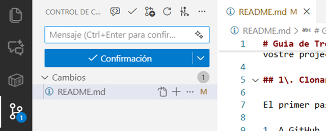
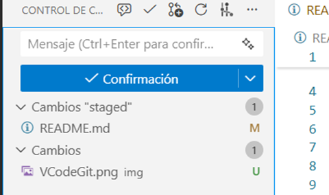
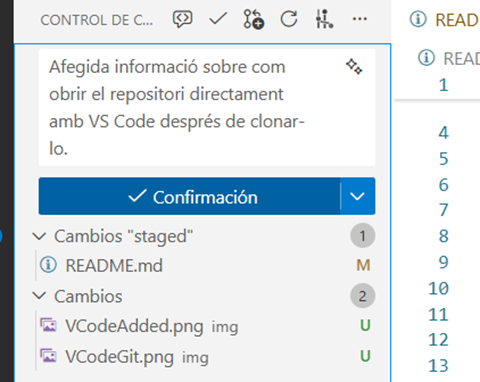
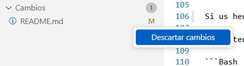
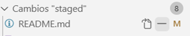
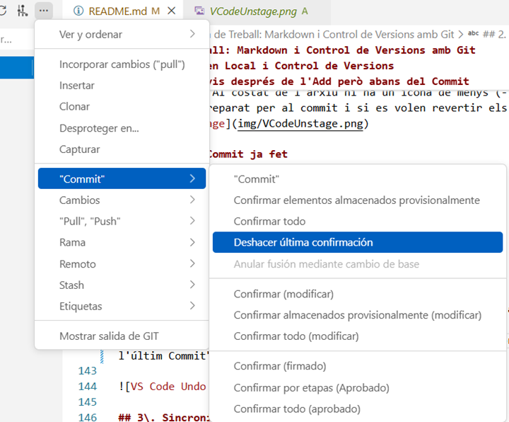
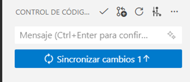
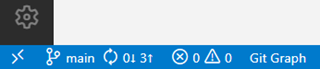
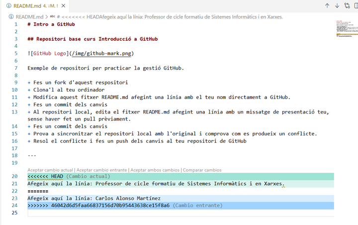

# Guia 2. Treballant en el repositori amb Git

A la Guia 1 hem vist com crear un compte a GitHub i com crear un primer repositori i com clonar aquest repositori a l'ordinador. En aquesta guia veurem com treballar amb Git per a gestionar els canvis i sincronitzar-los amb el repositori remot de GitHub.

## Edició en local i control de versions

Un cop teniu el fitxer `README.md` al vostre ordinador, podeu començar a editar-lo, així mateix afegirem nous fitxers: de text, imatges, etc. Recordeu que Git funciona com una "màquina del temps". Per desar un canvi oficialment, hem de passar per dues etapes:

### El cicle de treball (Add i Commit)

Els canvis que feu als fitxers no es guarden automàticament al vostre historial de versions, sinó que hi ha dues etapes: el staging o "zona de preparació" (Add) i el repositori.

El staging és com una llista de coses que voleu incloure en la propera "foto" del vostre projecte. Allà podem anar afegint els arxius que s'han modificat o creat de nous. Té l'avantatge que podem anar afegint conforme anem treballant, i després fer un sol commit amb tots els canvis.

El commit és l'acció de "fer una foto" del projecte en aquell moment. Aquí és on posem una etiqueta descriptiva per recordar què hem fet. Els diferents commits formen l'historial del projecte i s'identifiquen amb un codi únic (hash).

```plain
           ┌────────────────────┐
           │  Working Directory │
           │ (fitxers editats)  │
           └─────────┬──────────┘
                     │  git add
                     ▼
           ┌────────────────────┐
           │    Staging Area    │
           │ (fitxers preparats)│
           └─────────┬──────────┘
                     │ git commit
                     ▼
           ┌────────────────────┐
           │     Repository     │   
           │ (historial segur)  │ 
           └─────────┬──────────┘
                     │ git checkout
                     ▼
           ┌────────────────────┐
           │  Working Directory │
           └────────────────────┘
```

A més, la sincronització amb el repositori remot (GitHub) es fa amb les comandes `git push` (per pujar canvis) i `git pull` (per baixar canvis).

### Add i Commit per terminal

1. Afegir els canvis a la zona de preparació (Staging Area):  
   Això indica a Git quins fitxers volem incloure en la següent "foto".  

   ```Bash  
   git add nom_del_fitxer.md  
   # O per afegir-ho tot:  
   git add .
   ```

2. Confirmar els canvis (Commit):  
   Aquí posem una etiqueta al nostre canvi. Sigues descriptiu\!  

    ```Bash  
    git commit -m "Afegit apartat d'instal·lació a la guia"
    ```

### Add i Commit per VS Code

El primer caldrà fer, és definir l'usuari de Git (un nom i un correu) que serveix per identificar els nostres commits. Com que a l'ordinador de l'escola no tenim permisos per definir la configuració global, ho heu de repetir per a cada repositori:

Obriu la terminal integrada a VS Code (Ctrl + ñ) i executeu:

```Bash
git config user.name "El teu Nom"
git config user.email elteumail
```

Veureu que a la barra lateral esquerra hi ha una icona amb tres cercles i línies (Control de Codi Font o Ctrl + Shift + G).

A mesura que modifiqueu els fitxers .md, aquests apareixeran a la llista de "Canvis" (Changes).



- **Afegir els canvis (Add / Staging):**

    Al costat del nom del fitxer que heu editat, apareixerà una icona d'un més (+).

    Si premeu el +, el fitxer passarà a la secció "Canvis preparats" (Staged Changes). Això equival a fer un git add.

    

- **Confirmar els canvis (Commit):**

    A la part superior del panell veureu un quadre de text que diu "Missatge". Escriviu què heu fet (ex: Afegit apartat VS Code).

    Premeu el botó blau que diu "Confirmar" (Commit). Ara el canvi ja està guardat al vostre historial local.

    

### Desfer canvis respecte l'staging

Si us heu equivocat i voleu desfer els canvis respecte a la versió guardada en staging (sense necessitat de fer una succesió de CTRL+Z):

- Per terminal:  

```Bash
git checkout -- nom_del_fitxer.md
```

- Per VS Code: Feu clic dret sobre el fitxer a la llista de canvis i trieu "Descartar canvis" (Discard Changes).


### Desfer canvis després de l'Add però abans del Commit

Si heu fet un git add però encara no heu fet commit i voleu desfer l'add:

- Per terminal:  

```Bash
git reset nom_del_fitxer.md
```

- Per VS Code: Al costat de l'arxiu hi ha un icona de menys (-). Feu clic per treure'l de l'staging. L'arxiu encara tindrà els canvis, però ja no estarà preparat per al commit i si es volen revertir els canvis, farem l'acció de "Desfer canvis" (Discard Changes) explicada abans.


### Desfer un Commit ja fet

Si ja heu fet un commit però voleu desfer-lo:

- Per terminal:  

```Bash
git reset --soft HEAD~1
```

Això desfarà l'últim commit però mantindrà els canvis a la zona de preparació (staging area).

- Per VS Code: Feu clic als tres punts (...) a la part superior del panell de Control de Codi Font i dins l'opció Commit, trieu "Desfer l'últim Commit" (Undo Last Commit).



>**Nota**: Si volem retornar a un commit anterior i descartar tots els canvis posteriors, podem utilitzar `git reset --hard <hash_del_commit>` per terminal. Això eliminarà tots els canvis posteriors al commit especificat. En el cas de VS Code, aquesta opció no està disponible directament a la interfície gràfica, però amb el complement `Git Graph` es pot fer de manera visual.

## Sincronització amb el Repositori Remot

El vostre ordinador (Local) i GitHub (Remot) han d'estar sincronitzats.

- **Pujar canvis (Push):** Per enviar els vostres commits al servidor.  

```Bash  
git push origin main
```

- **Baixar canvis (Pull):** Molt important\! Abans de començar a treballar, descarregueu el que hagin fet els vostres companys.  

```Bash  
git pull origin main
```

De tota manera, VS Code fa que mantenir el vostre codi al dia amb GitHub sigui molt visual. Un cop heu fet el commit, el botó blau normalment canviarà a "Sincronitzar canvis" (Sync Changes) amb una icona de fletxes circulars.


**Sincronitzar** (Recomanat): Si premeu aquest botó, VS Code farà automàticament un Pull (per baixar canvis nous) i després un Push (per pujar els vostres). És la manera més fàcil d'evitar conflictes.

Si voleu més control, premeu els tres punts (...) de la part superior del panell de Control de Codi Font. Allà trobareu les opcions explícites de "Extraure" (Pull) i "Enviar" (Push).

Fixeu-vos en la barra d'estat (la part inferior blava de l'editor). Allà veureu unes fletxes amb números: la fletxa cap avall indica quants commits teniu pendents de baixar, i la cap amunt quants commits heu fet que encara no heu pujat a GitHub.



>**Important:** **Sincronitzeu SEMPRE abans de començar a treballar**. Us estalviareu el 90% dels conflictes!

## Gestió de Conflictes

Un conflicte apareix s'ha editat **la mateixa línia** del mateix fitxer i intentes fusionar els canvis. Git no sap quina versió és la bona i es queda "parat". Un cas habitual és quan es van fer canvis al fitxer que es van pujar a GitHub, i ara has modificat el mateix arxiu, però no has fet Pull abans de començar a treballar, de manera que hi ha dues versions diferents.

### Resolució de conflictes

Si en sincronitzar apareix un conflicte, VS Code és un dels millors editors per resoldre'ls:

Els fitxer en conflicte es marcaran amb colors i indicacions visuals de les línies on es produeix el conflicte, en verd el canvi proposat en local i en blau el canvi rebut del repositori remot.


Dins del fitxer, veureu botons a sobre del text que diuen:

```text
- Accept Current Change: Es queda amb el que tu has escrit.
- Accept Incoming Change: Es queda amb el que ha pujat el company.
- Accept Both Changes: Posa un text sota l'altre.
```

Un cop triat, prem el `+` al panell de control de versions per afegir els canvis al staging area (`add`), fes el commit i després sincronitza els canvis amb GitHub.
